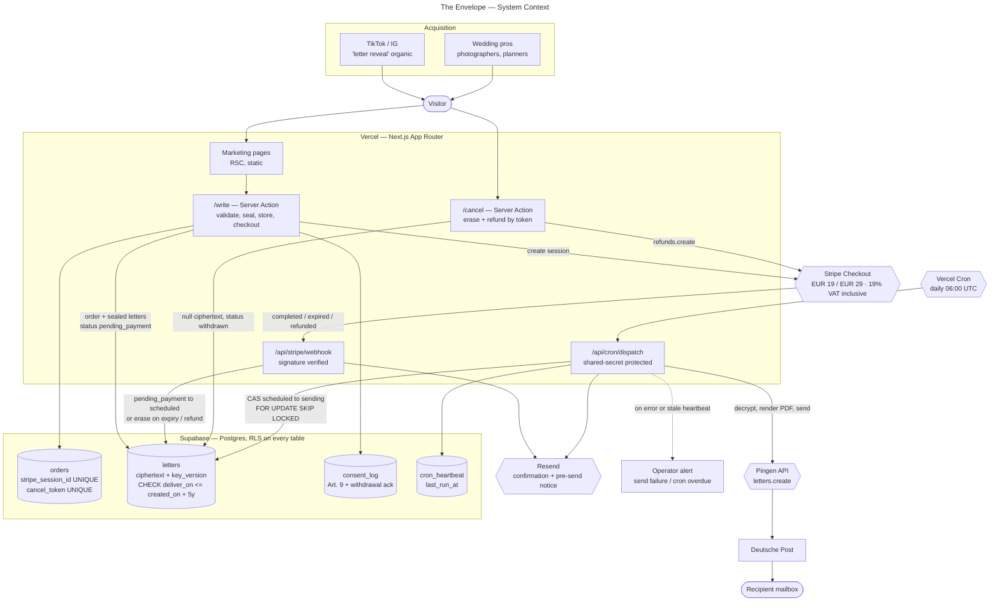

# The Envelope

Write a letter today. We seal it, hold it encrypted, and post it on paper on a
date you choose — up to five years out.

A wedding and anniversary keepsake. One-time purchase: **€19** for a single
letter, **€29** for a couple's pair. Operated from Germany, printed and posted
through Pingen on Deutsche Post rails.

**Live:** https://the-envelope-six.vercel.app

---

## Contents

- [Stack](#stack)
- [Getting started](#getting-started)
- [Architecture](#architecture)
  - [System context](#system-context)
  - [Checkout — the money path](#checkout--the-money-path)
  - [Notice, trigger and fulfilment — the mail path](#notice-trigger-and-fulfilment--the-mail-path)
- [Data model](#data-model)
- [The letter state machine](#the-letter-state-machine)
- [Pages](#pages)
- [Project layout](#project-layout)
- [Environment](#environment)
- [Encryption](#encryption)
- [Idempotency](#idempotency)
- [Email](#email)
- [Testing](#testing)
- [Operating it](#operating-it)
- [Scope guardrails](#scope-guardrails)
- [Open decisions](#open-decisions)
- [Before taking real money](#before-taking-real-money)

---

## Stack

Next.js 16 (App Router, RSC, Turbopack) · TypeScript · Tailwind v4 · Supabase
Postgres 17 · Stripe Checkout · Pingen · Resend · deployed on Vercel.

Five runtime dependencies: `next`, `react`, `@supabase/supabase-js`, `stripe`,
and `pdfkit` for the printed page. Everything else — validation, encryption,
email, date arithmetic — is a few dozen lines against the standard library,
because that was less code than wiring a library in.

## Getting started

```bash
npm install
cp .env.example .env.local   # then fill in the values
npm run dev
```

| Script | Does |
|---|---|
| `npm run dev` | Dev server on :3000 |
| `npm run build` | Production build |
| `npm run typecheck` | `next typegen` then `tsc --noEmit` |
| `npm run lint` | ESLint |
| `npm test` | Node's own test runner over `src/lib/*.test.ts` |

`next typegen` must run before `tsc` — Next generates the route types that
`layout.tsx` and `page.tsx` depend on.

Database migrations in [`supabase/migrations/`](supabase/migrations/) apply in
filename order. There is no ORM and no generated client: the four tables are
addressed by name through `supabase-js`.

---

## Architecture

Source of the diagrams below: [`docs/architecture/`](docs/architecture/). All
three are validated Mermaid and are kept in step with the code — if a diagram
and a file disagree, the diagram is the bug.

### System context



Two things about this shape are deliberate and easy to get wrong:

**The letter is written to the database before payment, not after.** A letter
body runs to twelve thousand characters; Stripe metadata holds five hundred.
So the letter is sealed and stored first, in `pending_payment` — a state the
dispatch worker cannot see — and the webhook only promotes it. An abandoned
checkout never leaves that state, and `checkout.session.expired` erases it.

**Nothing customer-facing ever holds a database credential.** Every table has
RLS enabled with no permissive policy, so the anon key reads nothing at all.
All writes go through the service role, server-side only.

### Checkout — the money path

```mermaid
---
title: The Envelope — Checkout (money path)
---
sequenceDiagram
    autonumber
    actor U as Customer
    participant A as Server Action
    participant DB as Supabase
    participant S as Stripe
    participant W as Webhook handler
    participant M as Email

    U->>A: letter(s), delivery date, recipient address, SKU
    A->>A: validate — horizon &lt;= 5y, body length, address shape
    Note over A,U: Both consent boxes are required and neither is<br/>pre-ticked. The pair SKU must yield two letters.

    A->>A: seal each body — AES-256-GCM, fresh IV, active key_version
    A->>DB: INSERT order (placeholder session id, status pending)
    A->>DB: INSERT letters (ciphertext, iv, key_version, pending_payment)
    Note over A,DB: Stored before payment: a letter body is far larger<br/>than Stripe metadata allows. pending_payment is<br/>invisible to the dispatch worker.

    A->>S: create Checkout Session (metadata.order_id)
    A->>DB: UPDATE order SET stripe_session_id = real id
    A->>DB: INSERT consent_log (text_version, ip, user_agent)
    A-->>U: redirect to hosted payment page

    alt paid
        U->>S: pay
        S->>W: checkout.session.completed
        W->>W: verify signature against the raw body
        W->>DB: UPDATE order SET paid, payment_intent_id WHERE session id
        W->>DB: UPDATE letters SET scheduled WHERE status = pending_payment
        alt rows promoted
            W->>M: confirmation email with cancel token
            W-->>S: 200
        else replay — zero rows matched
            W-->>S: 200, nothing done
        end
    else abandoned
        S->>W: checkout.session.expired
        W->>DB: erase ciphertext, status withdrawn
    end

    Note over U,DB: A later refund in the Stripe dashboard arrives as<br/>charge.refunded and erases the letters the same way,<br/>so money back always means the letter is stopped.
```

Three webhook events are handled, and each one exists to close a hole:

| Event | Without it |
|---|---|
| `checkout.session.completed` | Nothing is ever posted. |
| `checkout.session.expired` | Every abandoned cart leaves an encrypted letter in the table forever — personal data kept with no purpose left to serve. |
| `charge.refunded` | A refund issued in the Stripe dashboard gives the money back **and still posts the letter**. |

Prices are never taken from the client. `src/lib/pricing.ts` is the only place
an amount exists, VAT is derived from the gross figure by subtraction so net +
VAT always equals exactly what was charged, and there are no Stripe price ids
to drift out of step with it.

### Notice, trigger and fulfilment — the mail path

```mermaid
---
title: The Envelope — Notice, trigger and fulfilment (mail path)
---
sequenceDiagram
    autonumber
    participant SCH as Vercel Cron
    participant WK as Daily worker
    participant DB as Supabase
    participant M as Email
    participant P as Pingen API
    participant OP as Operator alert

    SCH->>WK: GET /api/cron/dispatch, Bearer CRON_SECRET
    Note over SCH,WK: Wrong or missing secret returns 404, not 401:<br/>an anonymous caller learns nothing.

    rect rgb(243, 234, 219)
        Note over WK,M: Pass 1 — the pre-send notice
        WK->>DB: claim_letters_to_notify(lead_days = 7)
        Note over WK,DB: notified_at is stamped inside the same UPDATE,<br/>so two runs cannot both email one person.
        loop each claimed letter
            WK->>M: notice — delivery date, full address, cancel token
            alt send failed
                WK->>DB: UPDATE letters SET notified_at = null
                Note over WK,DB: Tomorrow retries. Late beats twice.
            end
        end
    end

    rect rgb(243, 234, 219)
        Note over WK,P: Pass 2 — dispatch
        WK->>DB: claim_due_letters() — CAS to sending, SKIP LOCKED
        Note over WK,DB: deliver_on &lt;= current_date, so a missed run<br/>catches up instead of skipping a day forever.
        loop each claimed letter
            WK->>WK: decrypt via keyring[key_version]
            WK->>WK: render A4 PDF, address inside the DIN 5008 window
            WK->>P: letters.create, Idempotency-Key = letter id
            alt success
                P-->>WK: pingen_id
                WK->>DB: status sent, pingen_id, sent_at
            else failure
                WK->>DB: status retry, or failed after 5 attempts
                WK->>OP: alert — send failed, body never logged
            end
        end
    end

    WK->>DB: UPDATE cron_heartbeat SET last_run_at, last_sent_count
    WK->>DB: overdue_letter_count()
    alt backlog present
        WK->>OP: alert — letters overdue, scheduler may be dead
    end

    Note over SCH,OP: An external watchdog on cron_heartbeat.last_run_at<br/>catches the scheduler stopping altogether, which is<br/>otherwise silent until someone's letter arrives late.
```

The claim is the whole trick. `claim_due_letters()` flips `scheduled` to
`sending` inside a single `UPDATE … WHERE id IN (SELECT … FOR UPDATE SKIP
LOCKED)`, so two overlapping runs cannot both take the same row: the loser's
predicate no longer matches once the winner commits. Pingen then gets the
letter id as its idempotency key, so even a retry after a response we never
saw cannot produce a second posting.

`deliver_on <= current_date`, not `=`. A worker that was down for a day
catches up instead of silently skipping that day's letters forever.

---

## Data model

Four tables. [`supabase/migrations/0001_initial_schema.sql`](supabase/migrations/0001_initial_schema.sql)
carries the reasoning inline.

**`orders`** — one row per purchase. `stripe_session_id` is unique, which is
what makes webhook replay a no-op. `cancel_token` is a random uuid with a
unique index: a bearer credential, because there are no accounts.
`stripe_payment_intent_id` is captured by the webhook — you can refund a
payment intent, not a Checkout Session.

**`letters`** — one row per letter, two for the pair SKU. Holds
`content_ciphertext`, `content_iv` and `key_version`; never plaintext. All
three are nulled on withdrawal, so a deleted letter is actually gone rather
than merely flagged.

**`consent_log`** — append-only. The burden of proving consent sits with the
operator, so what was agreed is recorded with its text version, IP and user
agent, against the order, rather than as a boolean on it.

**`cron_heartbeat`** — one row. Lets an external watchdog notice the scheduler
has stopped, which is otherwise silent until somebody's letter arrives late.

Two constraints do work the application also does, on purpose:

```sql
constraint letters_horizon_max_5y
  check (deliver_on <= created_on + interval '5 years'),
constraint letters_deliver_in_future
  check (deliver_on > created_on),
```

`created_on` is a real `date` column rather than a cast of `created_at`,
because `timestamptz → date` is only `STABLE` and Postgres rejects
non-immutable expressions in a `CHECK`.

Every RPC is `SECURITY DEFINER`, which means RLS does not apply to it, and
Supabase exposes everything in the `public` schema through PostgREST. Postgres
grants `EXECUTE` to `PUBLIC` by default. That combination is why
[`0002_lock_down_rpc.sql`](supabase/migrations/0002_lock_down_rpc.sql) and the
tail of [`0004_pre_send_notice.sql`](supabase/migrations/0004_pre_send_notice.sql)
exist: **every function is revoked from `public`, `anon` and `authenticated`
and granted only to `service_role`.** Without it,
`/rest/v1/rpc/claim_due_letters` hands recipient addresses to anyone holding
the anon key — and strands every row it touches in `sending`.

## The letter state machine

```
                    compose + seal
                          │
                          ▼
                   pending_payment ──── checkout expired ────┐
                          │                                  │
             webhook: payment succeeded                      │
                          │                                  │
                          ▼                                  ▼
                      scheduled ──── cancel / refund ──► withdrawn
                          │                              (ciphertext
              claim_due_letters() (CAS)                    nulled)
                          │
                          ▼
                       sending
                       │     │
              Pingen ok│     │Pingen error
                       ▼     ▼
                     sent   retry ──(5 attempts)──► failed
                              │                       │
                              └── next daily run ◄────┘
```

Only `pending_payment`, `scheduled`, `retry` and `failed` can be withdrawn.
Once a letter is `sending` it is with Pingen and out of our hands, and
refunding it would be refunding something already delivered.

## Pages

| Route | Rendering | What it is |
|---|---|---|
| `/` | Static | Landing. One headline, one CTA above the fold. |
| `/write` | Static shell + client form | Compose, date, address, SKU, consent. The only interactive surface. |
| `/written` | Dynamic | Post-payment. Shows the cancel token once. `noindex`. |
| `/cancel` | Static shell + client form | Redeem a cancel token: erases the letter and refunds. |
| `/promise` | Static | The wind-down promise, in plain words. |
| `/privacy` | Static | GDPR Art. 13 notice. |
| `/terms` | Static | Terms of sale, including the cancellation right. |
| `/imprint` | Static | §5 TMG Impressum. Linked from every page footer. |
| `/api/stripe/webhook` | Dynamic | Signature-verified. Three events. |
| `/api/cron/dispatch` | Dynamic | Notices, then dispatch. 404s without the secret. |

The compose form is the only Client Component in the product. Everything it
accepts is re-validated in the Server Action, because nothing typed in a
browser is trusted — and the date bounds it renders are computed server-side
so they cannot be edited in the page.

## Project layout

```
src/
  app/
    page.tsx               landing
    write/                 compose form + server action
    written/               confirmation, shows the cancel token once
    cancel/                withdrawal form + server action
    promise|privacy|terms|imprint/
    api/stripe/webhook/    three Stripe events
    api/cron/dispatch/     daily notices + dispatch
    globals.css            design tokens, light and dark
  lib/
    crypto.ts              AES-256-GCM keyring: seal, open, secretsMatch
    letters.ts             validation and the horizon cap
    pricing.ts             the only place a price exists
    stripe.ts              checkout session, signature parsing, refunds
    pingen.ts              token → upload slot → letters.create
    pdf.ts                 A4 render, DIN 5008 address window
    email.ts               confirmation and pre-send notice
    withdraw.ts            erase + refund, and the erase-only path
    db.ts                  the single service-role client
    env.ts                 required-variable accessor
supabase/migrations/       schema, RPC lockdown, withdrawal, notices
docs/architecture/         the three diagrams above
scripts/
  pdf-proof.ts             renders a proof letter to check the window
  pingen-test-letter.ts    the week-zero live test
```

## Environment

Copy [`.env.example`](.env.example). Nothing here has a safe default except
the site URL and the Pingen base, which points at staging on purpose.

| Variable | Needed by | Note |
|---|---|---|
| `NEXT_PUBLIC_SITE_URL` | checkout redirects, email links | No trailing slash; it is stripped anyway. |
| `NEXT_PUBLIC_SUPABASE_URL` | everything server-side | |
| `SUPABASE_SERVICE_ROLE_KEY` | everything server-side | Bypasses RLS. Never ships to a client. |
| `STRIPE_SECRET_KEY` | checkout, refunds | |
| `STRIPE_WEBHOOK_SECRET` | webhook | Signature verification fails closed. |
| `LETTER_ENCRYPTION_KEYRING` | sealing and opening letters | See below. Escrow it offline. |
| `LETTER_ENCRYPTION_ACTIVE_VERSION` | sealing | Which key new letters use. |
| `PINGEN_CLIENT_ID` / `_SECRET` / `_ORGANISATION_ID` | dispatch | |
| `PINGEN_API_BASE` | dispatch | Staging until a real test letter has arrived. |
| `CRON_SECRET` | dispatch | Vercel Cron sends it as `Authorization: Bearer`. |
| `RESEND_API_KEY` | email | Unset means emails are logged and skipped, never an error. |
| `EMAIL_FROM` | email | |
| `ENABLE_AI_DRAFT` | draft assist | Off. Not part of v1. |

## Encryption

`src/lib/crypto.ts` is a **keyring**, not a key, and that is the single most
destructive thing in this codebase to get wrong.

A letter written today may not be decrypted for five years, so rotation has to
be additive: add a new version, point `LETTER_ENCRYPTION_ACTIVE_VERSION` at
it, and keep every older version in the keyring forever. Each letter stores
the `key_version` that opens it.

**Removing a version permanently destroys every letter encrypted under it, and
nobody finds out until the day someone expected post.** Keep an offline escrow
copy.

AES-256-GCM, 12-byte IV generated fresh per letter, 16-byte auth tag appended
to the ciphertext. The plaintext is decrypted exactly once, in the dispatch
worker, on the morning it is printed. It is never logged — not in an error
path, not in a failure message, not in an email.

## Idempotency

Every external boundary can deliver twice, so every one of them has a guard
that lives in the database rather than in a handler:

| Boundary | Guard |
|---|---|
| Stripe webhook replay | `orders.stripe_session_id` unique; every letter transition carries a status predicate, so a replay matches zero rows — including the email, which only sends when rows were actually promoted. |
| Two cron runs overlapping | `claim_due_letters()` — compare-and-swap inside one `UPDATE` with `FOR UPDATE SKIP LOCKED`. |
| Pingen retry after a lost response | `Idempotency-Key` is the letter's own id. |
| Two cron runs both emailing | `notified_at` is stamped by the claiming `UPDATE`; a failed send clears it so tomorrow retries. |
| Cancel token reuse | The erase is scoped to withdrawable statuses, so a second attempt erases nothing and reports `already_withdrawn`. |

## Email

Two plain-text messages, both promises the interface already makes:

**Confirmation**, sent by the webhook once payment clears, carrying the cancel
token. There are no accounts, so this is the only durable copy the customer
ends up holding — the confirmation page shows it once and never again.

**Pre-send notice**, sent seven days ahead by the worker, quoting the stored
address in full. Correcting a stale address is the entire point, so the
address is the body of the email.

`sendEmail` never throws. A payment that succeeded must not be reported as
failed because a mail provider is down, and a letter must not be blocked from
posting for the same reason. Callers decide what a failure means for them: the
webhook logs it, the worker clears `notified_at` and tries again tomorrow.

**The letter body never appears in an email.** It is material held encrypted
for years; putting it through a mail provider in cleartext would undo the
entire storage design.

## Testing

```bash
npm test
```

Node's own runner over `src/lib/*.test.ts` — no framework, no fixtures, no
config. The suite covers the parts where being wrong is expensive:

- **Crypto** — round-trip equals input, ciphertext never equals plaintext, a
  tampered tag fails, a missing key version throws loudly rather than
  returning junk.
- **Stripe signatures** — real HMACs built with Stripe's own
  `generateTestHeaderString`, including the case that catches the classic bug:
  a payload re-serialised into identical-looking JSON is rejected, because the
  bytes changed.
- **Pricing** — net plus VAT equals gross exactly, for both SKUs.
- **Horizon** — the cap, the leap-day rollover, dates that look real but do
  not exist (`2027-02-31`), and the boundary at exactly five years.
- **Email** — the cancel token is present, both addresses appear for a pair,
  and the optional address line leaves no blank gap when empty.
- **Withdrawal** — which statuses are withdrawable, and that a malformed token
  is indistinguishable from an unknown one.

What is *not* covered, and why: anything needing a live Stripe, Supabase or
Pingen account. Those are verified by the runbook below, not by mocks that
would only prove the mocks agree with themselves.

## Operating it

**Daily.** Vercel Cron calls `/api/cron/dispatch` at 06:00 UTC. It returns
`{ claimed, sent, failed, notices, overdue }`. A non-zero `overdue` means
letters are past their date and still unsent — the scheduler stopped, or
Pingen is rejecting everything.

**Watchdog.** `cron_heartbeat.last_run_at` is the one signal that catches the
scheduler dying altogether. Nothing in this repo watches it; that check has to
live outside, or the failure is silent until someone's letter arrives late.

**A letter stuck in `sending`.** It was claimed and the worker died before
Pingen answered. Check Pingen for a letter whose idempotency key is that
letter's id. If it exists, mark the row `sent` with that `pingen_id`; if it
does not, put the row back to `retry`.

**Rotating the encryption key.** Add the new version to the keyring *beside*
the old ones, then move `LETTER_ENCRYPTION_ACTIVE_VERSION`. Never remove a
version. Confirm the old ones are still in the escrow copy first.

**Refunding.** Either path works and both stop the letter: a customer using
their cancel token at `/cancel`, or a refund in the Stripe dashboard, which
arrives as `charge.refunded` and erases the letters the same way.

## Scope guardrails

These are load-bearing, not preferences. Each came out of a risk assessment,
and removing one re-introduces a risk that was deliberately engineered out.

- **One trigger type: a future date.** No dead-man's-switch, no inactivity
  triggers.
- **No third-party letters.** Self-directed only. Mailing disclosures *about*
  someone to a third party invites defamation and GDPR exposure, and reads as
  coercion to a payment processor.
- **Horizon capped at 5 years** (12 months default), enforced in both app
  validation and a database `CHECK`.
- **Pay-at-send fulfilment.** Postage is only spent when the trigger fires, so
  the stored liability is a promise, not money already gone.
- **Published wind-down promise.** If the service closes, undelivered letters
  are posted early or returned.

## Open decisions

Whether the sale is classified as goods or as a service is still open, and it
determines the VAT treatment and the exact consent wording.

The code takes the conservative path either way: a pending letter can always
be cancelled, which deletes it and refunds the payment. That satisfies a
withdrawal right if one applies and costs nothing if one does not, so the
classification no longer blocks the schema. Working notes are kept outside
this repository.

The consent wording is versioned (`CONSENT_TEXT_VERSION`) so the evidence in
`consent_log` still means something years after the text changes. The
mechanism is built; the German text itself has not been reviewed by a lawyer.

## Before taking real money

In order, because each one gates the next:

1. **Post yourself a real letter** with `scripts/pingen-test-letter.ts`.
   Nothing in `src/lib/pingen.ts` or the DIN 5008 address placement has been
   run against a live Pingen account. Until an envelope physically arrives,
   the fulfilment path is *probably* right, not known good.
2. **Set the environment variables in Vercel.** Until they exist the site
   renders but nothing transacts.
3. **Fill the bracketed placeholders** in `/imprint`, `/privacy` and `/terms`
   — operator name, address, telephone, VAT id. They are deliberately not
   invented, and the Impressum says so on its face.
4. **Run Stripe against a live account** — `stripe listen`, one real card, one
   refund, one expiry. The signature path is tested; an end-to-end payment is
   not.
5. **Have the consent wording and the goods-vs-service call reviewed.**

## Security

Never commit real credentials. See [SECURITY.md](SECURITY.md), including the
encryption keyring rules.

The trust model in one paragraph: the anon key reads nothing, every RPC is
service-role only, the cron route answers 404 rather than 401 so it cannot be
probed, the cancel token is a bearer credential that never appears in a URL,
and no code path logs a letter body.
