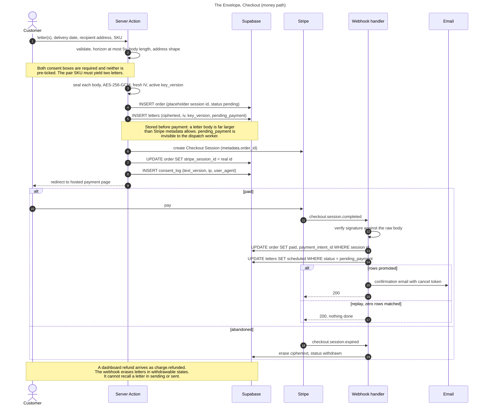
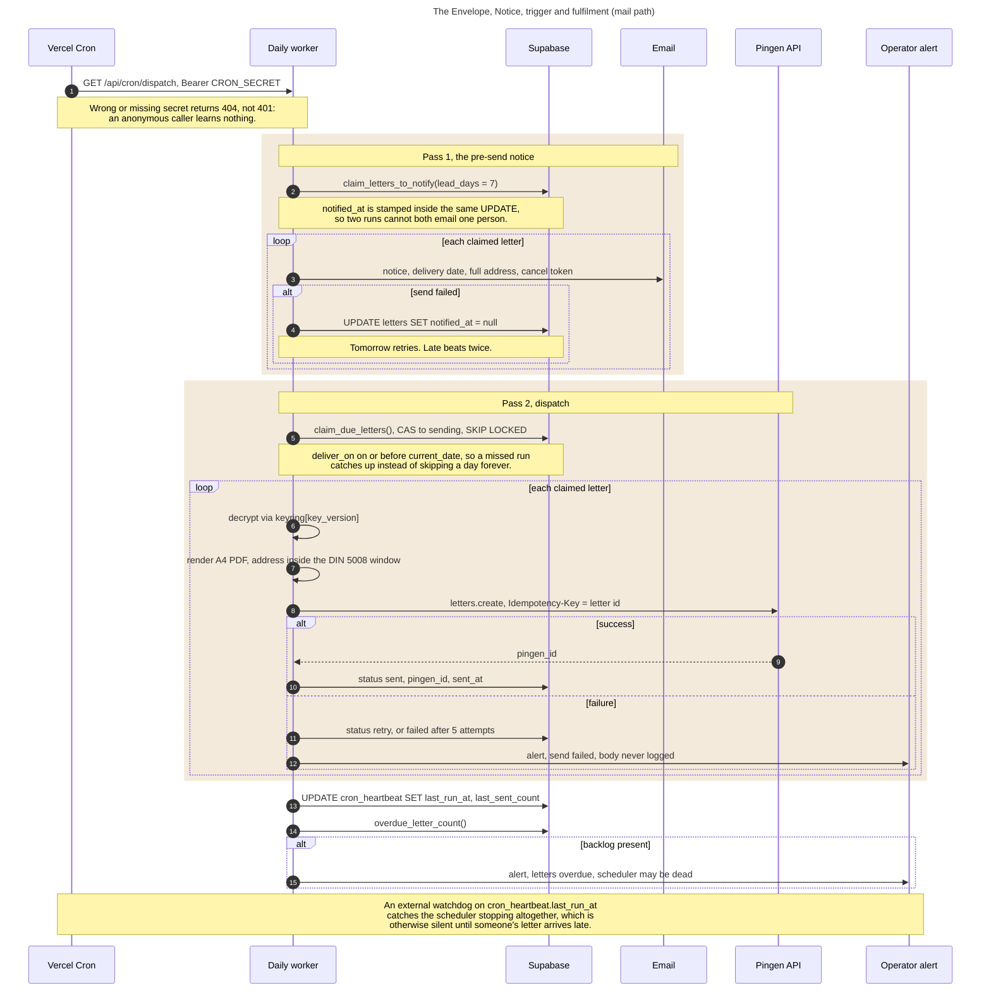

# The Envelope

[](https://github.com/kandulanikhilvarma/the-envelope/actions/workflows/ci.yml)

Write a letter today. We seal it, hold it encrypted, and post it on paper on a
date you choose, up to five years out.

A wedding and anniversary keepsake. One-time purchase: **€19** for a single
letter, **€29** for a couple's pair. Operated from Germany, printed and posted
through Pingen on Deutsche Post rails.

[Deployed site](https://the-envelope-six.vercel.app) · [Write a letter](https://the-envelope-six.vercel.app/write) · [Manage your letter](https://the-envelope-six.vercel.app/manage)

The chosen date is the posting date, rather than a guaranteed arrival date.
Live payment, physical delivery and legal review need separate launch checks.
See [LICENSE](LICENSE) for the proprietary terms.

---

## What customers can do

- Write one letter or a pair, with a paper preview and a draft saved in the current browser tab.
- Choose a posting date from tomorrow to five years ahead. The default is twelve months.
- Pay once through Stripe Checkout. There are no customer accounts or subscriptions.
- Use a private reference to check status and correct each letter's address before print work starts.
- Use the same reference to cancel an eligible order, erase its letter content and get a refund.

The reference is a bearer credential: anyone who holds it can manage or cancel the order.
Management shows posting details and addresses, never the letter body.
The management and cancellation forms keep the reference out of browser URLs and persistent browser storage.

## Contents

- [What customers can do](#what-customers-can-do)
- [Stack](#stack)
- [Getting started](#getting-started)
- [Architecture](#architecture)
  - [System context](#system-context)
  - [Checkout, the money path](#checkout-the-money-path)
  - [Notice, trigger and fulfilment, the mail path](#notice-trigger-and-fulfilment-the-mail-path)
- [Data model](#data-model)
- [The letter state machine](#the-letter-state-machine)
- [Pages](#pages)
- [Design system](#design-system)
- [Project layout](#project-layout)
- [Environment](#environment)
- [Production hardening](#production-hardening)
- [Encryption](#encryption)
- [Idempotency](#idempotency)
- [Email](#email)
- [Testing](#testing)
- [Operate the service](#operate-the-service)
- [Scope guardrails](#scope-guardrails)
- [Open decisions](#open-decisions)
- [Before taking real money](#before-taking-real-money)
- [Security](#security)
- [License and contributions](#license-and-contributions)

---

## Stack

The locked app versions are Next.js 16.3.5 and React 19.2.8.

Next.js 16 (App Router, RSC, Turbopack) · TypeScript · Tailwind v4 · Supabase Postgres 17.
Stripe Checkout · Pingen · Resend · deployed on Vercel.

Six runtime dependencies: `next`, `react`, `react-dom`, `@supabase/supabase-js`, `stripe`,
and `pdfkit` for the printed page.
Validation, encryption, email and date arithmetic use the platform and standard library.
The project keeps these small functions in the codebase instead of adding libraries for them.

## Getting started

Use Node.js 22 with native TypeScript support and npm. CI also uses Node.js 22.
The project scripts run TypeScript files directly through Node.
Apply all five SQL migrations in filename order before you test service connections.
Fill `.env.local` with your service credentials and encryption keys.

For macOS or Linux:

```bash
npm ci
cp .env.example .env.local   # then fill in the values
npm run dev
```

For PowerShell:

```powershell
npm ci
Copy-Item .env.example .env.local # then fill in the values
npm run dev
```

Open [localhost:3000](http://localhost:3000).
Public pages can load without every credential. Checkout, management and dispatch need their service settings.
Use your Supabase SQL tools to apply migrations; this repository has no migration command.

| Script | Does |
|---|---|
| `npm run dev` | Dev server on :3000 |
| `npm run build` | Production build |
| `npm start` | Serve a completed production build |
| `npm run typecheck` | `next typegen` then `tsc --noEmit` |
| `npm run lint` | ESLint |
| `npm test` | Node's own test runner over `src/lib/*.test.ts` |
| `npm run test:manage` | Isolated browser checks for private letter management; requires Playwright and Chromium or a configured browser channel |
| `npm run preflight` | Contacts every real dependency and reports which connections work and which do not |
| `npm run pdf-proof` | Renders a letter and checks the address lands in the DIN 5008 window |
| `npm run test-letter` | Posts one real letter through Pingen, the week-zero gate |

`next typegen` must run before `tsc`. Next generates the route types that
`layout.tsx` and `page.tsx` depend on.

Database migrations in [`supabase/migrations/`](supabase/migrations/) apply in
filename order. There is no ORM and no generated client.
Server code addresses the five tables by name through `supabase-js`.

---

## Architecture

The diagrams below show the system context, checkout and mail flow.
All three remain visible here. Their source files are in [docs/architecture](docs/architecture/).
Keep the README diagrams in sync with those source files and the code.

### System context


```mermaid
---
title: The Envelope, System Context
---
flowchart TB
    subgraph acq["Acquisition"]
        TT["TikTok / IG<br/>'letter reveal' organic"]
        WP["Wedding pros<br/>photographers, planners"]
    end

    V(["Visitor"])
    TT --> V
    WP --> V

    subgraph vercel["Vercel, Next.js App Router"]
        MKT["Marketing pages<br/>RSC, static"]
        APP["/write, Server Action<br/>validate, seal, store, checkout"]
        MAN["/manage, Server Actions<br/>status + address by private reference"]
        CXL["/cancel, Server Action<br/>erase + refund by token"]
        HOOK["/api/stripe/webhook<br/>signature verified"]
        CRON["/api/cron/dispatch<br/>shared-secret protected"]
    end

    V --> MKT
    MKT --> APP
    V --> CXL
    V --> MAN

    subgraph supa["Supabase, Postgres, RLS on every table"]
        ORD[("orders<br/>stripe_session_id UNIQUE<br/>cancel_token UNIQUE")]
        LET[("letters<br/>ciphertext + key_version<br/>5-year horizon CHECK")]
        CON[("consent_log<br/>Art. 9 + withdrawal ack")]
        HB[("cron_heartbeat<br/>last_run_at")]
    end

    APP -->|"order + sealed letters<br/>status pending_payment"| LET
    APP --> ORD
    APP --> CON
    HOOK -->|"pending_payment to scheduled<br/>or erase on expiry / refund"| LET
    CXL -->|"null ciphertext, status withdrawn"| LET
    MAN -->|"authorize reference"| ORD
    MAN -->|"metadata only + conditional address update"| LET
    CRON -->|"CAS scheduled to sending<br/>FOR UPDATE SKIP LOCKED"| LET
    CRON --> HB

    STRIPE{{"Stripe Checkout<br/>EUR 19 / EUR 29 · 19% VAT inclusive"}}
    APP -->|"create session"| STRIPE
    STRIPE -->|"completed / expired / refunded"| HOOK
    CXL -->|"refunds.create"| STRIPE

    MAIL{{"Resend<br/>confirmation + pre-send notice"}}
    HOOK --> MAIL
    CRON --> MAIL

    SCHED{{"Vercel Cron<br/>daily 06:00 UTC"}}
    SCHED --> CRON

    PIN{{"Pingen API<br/>letters.create"}}
    CRON -->|"decrypt, render PDF, send"| PIN
    PIN --> DP["Deutsche Post"]
    DP --> RCP(["Recipient mailbox"])

    ALERT["Operator alert<br/>send failure / cron overdue"]
    CRON -.->|"on send failure or overdue letters"| ALERT
```

Two things about this shape are deliberate and easy to get wrong:

**The app writes the letter to the database before payment, not after.**
A letter body can contain twelve thousand characters; Stripe metadata holds five hundred.
The app seals and stores the letter first, in `pending_payment`.
The dispatch worker cannot claim that state; only the webhook promotes the letter.
An abandoned checkout never leaves that state, and `checkout.session.expired` erases it.

**Nothing customer-facing ever holds a database credential.** Every table has
RLS enabled with no permissive policy, so the anon key reads nothing at all.
All writes go through the service role, server-side only.

### Checkout, the money path


```mermaid
---
title: The Envelope, Checkout (money path)
---
sequenceDiagram
    autonumber
    actor U as Customer
    participant A as Server Action
    participant DB as Supabase
    participant S as Stripe
    participant W as Webhook handler
    participant M as Email

    U->>A: letter(s), delivery date, recipient address, SKU
    A->>A: validate, horizon at most 5y, body length, address shape
    Note over A,U: Both consent boxes are required and neither is<br/>pre-ticked. The pair SKU must yield two letters.

    A->>A: seal each body, AES-256-GCM, fresh IV, active key_version
    A->>DB: INSERT order (placeholder session id, status pending)
    A->>DB: INSERT letters (ciphertext, iv, key_version, pending_payment)
    Note over A,DB: Stored before payment: a letter body is far larger<br/>than Stripe metadata allows. pending_payment is<br/>invisible to the dispatch worker.

    A->>S: create Checkout Session (metadata.order_id)
    A->>DB: UPDATE order SET stripe_session_id = real id
    A->>DB: INSERT consent_log (text_version, ip, user_agent)
    A-->>U: redirect to hosted payment page

    alt paid
        U->>S: pay
        S->>W: checkout.session.completed
        W->>W: verify signature against the raw body
        W->>DB: UPDATE order SET paid, payment_intent_id WHERE session id
        W->>DB: UPDATE letters SET scheduled WHERE status = pending_payment
        alt rows promoted
            W->>M: confirmation email with cancel token
            W-->>S: 200
        else replay, zero rows matched
            W-->>S: 200, nothing done
        end
    else abandoned
        S->>W: checkout.session.expired
        W->>DB: erase ciphertext, status withdrawn
    end

    Note over U,DB: A dashboard refund arrives as charge.refunded.<br/>The webhook erases letters in withdrawable states.<br/>It cannot recall a letter in sending or sent.
```

Three webhook events close separate failure cases:
A refund cannot recall a letter already in `sending` or `sent`.

| Event | Without it |
|---|---|
| `checkout.session.completed` | Nothing is ever posted. |
| `checkout.session.expired` | Every abandoned cart leaves an encrypted letter in the table forever, personal data kept with no purpose left to serve. |
| `charge.refunded` | Without this handler, a dashboard refund leaves eligible letters scheduled for post. The handler erases withdrawable letters. |

The server never takes prices from the client.
`src/lib/pricing.ts` is the only place an amount exists.
The app derives VAT from the gross figure by subtraction.
Net plus VAT always equals the charge exactly.
There are no Stripe price IDs that can drift out of step with it.

### Notice, trigger and fulfilment, the mail path


```mermaid
---
title: The Envelope, Notice, trigger and fulfilment (mail path)
---
sequenceDiagram
    autonumber
    participant SCH as Vercel Cron
    participant WK as Daily worker
    participant DB as Supabase
    participant M as Email
    participant P as Pingen API
    participant OP as Operator alert

    SCH->>WK: GET /api/cron/dispatch, Bearer CRON_SECRET
    Note over SCH,WK: Wrong or missing secret returns 404, not 401:<br/>an anonymous caller learns nothing.

    rect rgb(243, 234, 219)
        Note over WK,M: Pass 1, the pre-send notice
        WK->>DB: claim_letters_to_notify(lead_days = 7)
        Note over WK,DB: notified_at is stamped inside the same UPDATE,<br/>so two runs cannot both email one person.
        loop each claimed letter
            WK->>M: notice, delivery date, full address, cancel token
            alt send failed
                WK->>DB: UPDATE letters SET notified_at = null
                Note over WK,DB: Tomorrow retries. Late beats twice.
            end
        end
    end

    rect rgb(243, 234, 219)
        Note over WK,P: Pass 2, dispatch
        WK->>DB: claim_due_letters(), CAS to sending, SKIP LOCKED
        Note over WK,DB: deliver_on on or before current_date, so a missed run<br/>catches up instead of skipping a day forever.
        loop each claimed letter
            WK->>WK: decrypt via keyring[key_version]
            WK->>WK: render A4 PDF, address inside the DIN 5008 window
            WK->>P: letters.create, Idempotency-Key = letter id
            alt success
                P-->>WK: pingen_id
                WK->>DB: status sent, pingen_id, sent_at
            else failure
                WK->>DB: status retry, or failed after 5 attempts
                WK->>OP: alert, send failed, body never logged
            end
        end
    end

    WK->>DB: UPDATE cron_heartbeat SET last_run_at, last_sent_count
    WK->>DB: overdue_letter_count()
    alt backlog present
        WK->>OP: alert, letters overdue, scheduler may be dead
    end

    Note over SCH,OP: An external watchdog on cron_heartbeat.last_run_at<br/>catches the scheduler stopping altogether, which is<br/>otherwise silent until someone's letter arrives late.
```

The atomic claim prevents duplicate work.
`claim_due_letters()` flips `scheduled` to `sending` inside a single `UPDATE … WHERE id IN (SELECT … FOR UPDATE SKIP LOCKED)`.
Two concurrent runs cannot both take the same row: the loser's predicate no longer matches once the winner commits.
Pingen then gets the letter ID as its idempotency key.
A retry after a response we never saw uses the same letter ID.
This guard aims to prevent a second postal dispatch.
A live test must verify the provider's idempotency behavior.

`deliver_on <= current_date`, not `=`.
If the worker stops for a day, the next run catches up.
The worker does not silently skip that day's letters forever.

---

## Data model

Five tables. [`supabase/migrations/0001_initial_schema.sql`](supabase/migrations/0001_initial_schema.sql)
carries the reasoning inline.

**`orders`**, one row per purchase. `stripe_session_id` is unique, which is
what makes webhook replay a no-op. `cancel_token` is a random uuid with a
unique index: a bearer credential, because there are no accounts.
The webhook captures `stripe_payment_intent_id`.
You can refund a payment intent, not a Checkout Session.

**`letters`**, one row per letter, two for the pair SKU. Holds
`content_ciphertext`, `content_iv` and `key_version`; never plaintext.
Withdrawal nulls all three fields, so the app removes a deleted letter's content rather than only marking it as deleted.

**`consent_log`**, append-only. The operator must prove consent.
The app records the agreement against the order, with its text version, IP and user agent.
The evidence contains more than a boolean on the order.

**`cron_heartbeat`**, one row. Lets an external watchdog notice the scheduler
has stopped, which is otherwise silent until somebody's letter arrives late.

**`rate_limit`**, transient counters for the three actions a stranger can submit.
Compose, cancellation and management each have a separate counter. The bucket key holds a SHA-256 of the caller's IP, never the address, and
the daily worker sweeps rows older than a day.

Two constraints do work the application also does, on purpose:

```sql
constraint letters_horizon_max_5y
  check (deliver_on <= created_on + interval '5 years'),
constraint letters_deliver_in_future
  check (deliver_on > created_on),
```

`created_on` stores a date separately from `created_at`.
A `timestamptz → date` cast depends on the session time zone.
The stored date keeps the horizon check tied to the date of creation.

Every RPC is `SECURITY DEFINER`, which means RLS does not apply to it, and
Supabase exposes everything in the `public` schema through PostgREST. Postgres
grants `EXECUTE` to `PUBLIC` by default. That combination is why
[`0002_lock_down_rpc.sql`](supabase/migrations/0002_lock_down_rpc.sql) and the
tail of [`0004_pre_send_notice.sql`](supabase/migrations/0004_pre_send_notice.sql)
exist: **the migrations revoke every function from `public`, `anon` and `authenticated`.
They grant access only to `service_role`.** Without that restriction,
`/rest/v1/rpc/claim_due_letters` hands recipient addresses to anyone holding
the anon key, and strands every row it touches in `sending`.

## The letter state machine

```
                    compose + seal
                          │
                          ▼
                   pending_payment ──── checkout expired ────┐
                          │                                  │
             webhook: payment succeeded                      │
                          │                                  │
                          ▼                                  ▼
                      scheduled ──── cancel / refund ──► withdrawn
                          │                              (ciphertext
              claim_due_letters() (CAS)                    nulled)
                          │
                          ▼
                       sending
                       │     │
              Pingen ok│     │Pingen error
                       ▼     ▼
                     sent   retry ──(5 attempts)──► failed
                              │                       │
                              └── next daily run     operator action
                                                       needed before retry
```

Withdrawal accepts only `pending_payment`, `scheduled`, `retry` and `failed`.
Once dispatch claims a letter as `sending`, customer cancellation cannot stop it.
The claim means print work has started; the code does not prove physical delivery.
A `failed` letter does not return to the daily queue without operator action.

## Pages

| Route | Rendering | What it is |
|---|---|---|
| `/` | Static | Landing: hero, four-step timeline, six occasions, example letter, pricing, commitments, FAQ with JSON-LD. |
| `/write` | Dynamic + client form | Package, letters, date presets, address and consent, with a live paper preview. Keeps the draft in `sessionStorage` for the tab. `?occasion=` swaps the writing prompts. `?sku=pair` preselects the pair. `?cancelled=1` explains a cancelled payment. |
| `/written` | Dynamic | Post-payment. Lists each sealed letter. Shows the private reference with a copy button. Offers an `.ics` calendar file. Clears the draft. `noindex`. |
| `/manage` | Static shell + client form | Use the private reference to check delivery status. Update each letter's address before print work starts. No account; no letter content retrieved. `noindex`. |
| `/cancel` | Static shell + client form | Redeem a cancel token: erases the letter and refunds. |
| `/promise` | Static | The wind-down promise, in plain words. |
| `/privacy` | Static | GDPR Art. 13 notice. |
| `/terms` | Static | Terms of sale, including the cancellation right. |
| `/imprint` | Static | §5 DDG Impressum. Linked from every page footer. |
| `/api/stripe/webhook` | Dynamic | Signature-verified. Three events. |
| `/api/cron/dispatch` | Dynamic | Notices, then dispatch. 404s without the secret. |
| `/robots.txt` | Static | Keeps `/written`, `/manage`, `/cancel` and the API out of search results. |
| `/sitemap.xml` | Static | The six pages that visitors can find through search. |
| `/opengraph-image`, `/apple-icon`, `/icon.svg`, `/manifest.webmanifest` | Static | Share card and icons, generated from the seal artwork at build time. |
| `not-found.tsx` | Static | 404, with the three places people actually meant to go. |
| `error.tsx` / `global-error.tsx` | Client | Error boundaries. Show a digest, never the error text. |

The Server Action re-validates everything the compose form accepts because the server cannot trust browser input.
The form controls its inputs, so a server-side validation error never wipes a long letter.
The server computes the date bounds for each request, so they cannot go stale between deploys.

## Design system

See [DESIGN.md](DESIGN.md) for the full design record.
See [PRODUCT.md](PRODUCT.md) for the product brief and management constraints.

- **Colour.** Warm neutral base (ivory paper), with one saturated primary (oxblood wax) reserved for actions.
  An analogous antique gold supplies decoration, and a single complementary sage marks confirmed states. Every
  text pairing passes WCAG 2.2 AA in both themes.
  `globals.css` notes the ratios beside each token.
- **Type.** Fraunces for display (roman and italic), Source Serif 4 for
  body, both self-hosted by `next/font`.
- **Imagery.** Inline SVG illustrations in `components/art.tsx` use the colour tokens, so they follow light and dark mode.
  They stay sharp at any density and weigh a few kilobytes. The only raster image is the share
  card, rendered to PNG at build time.
- **Components.** `.btn`, `.field`, `.card`, `.link` and `.eyebrow` live in
  `globals.css`; the header, footer and logo in `components/site-chrome.tsx`;
  the icon set in `components/icons.tsx`.
- **Motion.** Three short CSS animations (float, rise, stamp), all disabled
  under `prefers-reduced-motion`.
- **Copy.** Plain, professional language with no em dashes.

## Project layout

```
src/
  app/
    page.tsx               landing
    write/                 compose form + server action
    written/               confirmation, private reference and calendar file
    manage/                private status lookup + address updates
    cancel/                withdrawal form + server action
    promise|privacy|terms|imprint/
    api/stripe/webhook/    three Stripe events
    api/cron/dispatch/     daily notices + dispatch
    globals.css            design tokens, light and dark
    opengraph-image.tsx    share card, rendered at build time
  components/
    art.tsx                SVG illustrations and the wax seal
    icons.tsx              stroke icon set
    site-chrome.tsx        header, footer, logo
    address-fields.tsx     shared accessible postal-address fields
  lib/
    crypto.ts              AES-256-GCM keyring: seal, open, secretsMatch
    letters.ts             validation and the horizon cap
    occasions.ts           occasion cards and writing prompts
    ics.ts                 calendar file for the posting date
    draft.ts               sessionStorage key for the unsent draft
    pricing.ts             the only place a price exists
    stripe.ts              checkout session, signature parsing, refunds
    pingen.ts              token → upload slot → letters.create
    pdf.ts                 A4 render, DIN 5008 address window
    email.ts               confirmation and pre-send notice
    withdraw.ts            erase + refund, and the erase-only path
    manage.ts              token authorization, metadata lookup, conditional address update
    management.ts          serializable management types and status language
    countries.ts           country options shared by compose and management
    rate-limit.ts          Postgres-backed limiter for the open POST paths
    db.ts                  the single service-role client
    env.ts                 required-variable accessor
supabase/migrations/       schema, RPC lockdown, withdrawal, notices, limits
docs/architecture/         the three diagrams above
scripts/
  preflight.ts             proves every dependency answers, prints no secrets
  pdf-proof.ts             renders a proof letter to check the window
  pingen-test-letter.ts    the week-zero live test
```

## Environment

Copy [`.env.example`](.env.example). Nothing here has a safe default except
the site URL and the Pingen base, which points at staging on purpose.

| Variable | Needed by | Note |
|---|---|---|
| `NEXT_PUBLIC_SITE_URL` | checkout redirects, email links, sitemap | Optional on Vercel: falls back to the injected production host, so a deploy never publishes `localhost`. |
| `NEXT_PUBLIC_SUPABASE_URL` | everything server-side | |
| `SUPABASE_SERVICE_ROLE_KEY` | everything server-side | Bypasses RLS. Never ships to a client. |
| `STRIPE_SECRET_KEY` | checkout, refunds | |
| `STRIPE_WEBHOOK_SECRET` | webhook | Signature verification fails closed. |
| `LETTER_ENCRYPTION_KEYRING` | sealing and opening letters | See below. Escrow it offline. |
| `LETTER_ENCRYPTION_ACTIVE_VERSION` | sealing | Which key new letters use. |
| `PINGEN_CLIENT_ID` / `_SECRET` / `_ORGANISATION_ID` | dispatch | |
| `PINGEN_API_BASE` | dispatch | Staging until a real test letter has arrived. |
| `CRON_SECRET` | dispatch | Vercel Cron sends it as `Authorization: Bearer`. |
| `RESEND_API_KEY` | email | Without it, the app logs a warning and skips email, never an error. |
| `EMAIL_FROM` | email | |
| `OPERATOR_EMAIL` | dispatch alerts | Unset means a failed send only reaches the logs. |
| `ENABLE_AI_DRAFT` | Reserved flag | No draft-assist feature uses it. |

The template also contains `NEXT_PUBLIC_SUPABASE_ANON_KEY`; the app does not use it.
Preflight needs an explicit `NEXT_PUBLIC_SITE_URL` even though the app supports Vercel host fallback.
Customer confirmations, notices and operator alerts need the email settings in service.

To generate an encryption key:

```sh
node -e "console.log(require('crypto').randomBytes(32).toString('base64'))"
```

To generate a cron secret:

```sh
node -e "console.log(require('crypto').randomBytes(32).toString('base64url'))"
```

## Production hardening

**Rate limiting.** `/write`, `/cancel` and `/manage` accept submissions without an account.
The counters live in Postgres because each serverless instance has separate memory that can reset.
An in-memory counter cannot enforce a shared limit on Vercel.

| Action | Limit | When counted |
|---|---|---|
| Compose | Five submissions in ten minutes | After input and consent checks. |
| Cancel | Ten tries in one hour | Before reference checks. |
| Manage | Thirty lookups, refreshes or edits in ten minutes | Before reference and address checks. |

The limiter fails open if its database check fails.
This policy prevents a small limiter outage from causing rejected customer submissions.
Counters use a hash of the caller IP; they do not store the IP address.

**Response headers.** HSTS, `nosniff`, `X-Frame-Options: DENY` (a cancel form
inside someone else's frame is a clickjacking target), a strict referrer
policy, a closed `Permissions-Policy`, and `Cross-Origin-Opener-Policy`.
`poweredByHeader` is off. There is deliberately **no CSP**: Next injects
inline scripts for hydration, so a real policy needs per-request nonces
through middleware. A policy loose enough to allow `unsafe-inline` gives no useful protection.

**Error boundaries.** `error.tsx` and `global-error.tsx` show the digest and
nothing else. An error here can carry a letter body, a recipient address or a Stripe ID in its message.
None of that belongs on a screen. The global
boundary styles itself inline because a root layout failure leaves it without fonts or tokens.
The global boundary uses a plain anchor, so the browser reloads rather than enters the broken tree again.

**Crawlers.** `/written` renders a private reference; `/manage` and `/cancel`
redeem it. `robots.txt` disallows all three, and they carry `noindex`.
The sitemap lists only the six pages that visitors can find through search.

**Operator alerts.** The architecture always showed an alert box; the code
only ever wrote to a log.
A run that fails a send, or finds an overdue backlog, now emails `OPERATOR_EMAIL` with letter IDs and error text.
That email never contains a body or a recipient address.
If that variable is unset, the worker records the lack of an alert recipient in the log.

## Encryption

`src/lib/crypto.ts` is a **keyring**, not a key, and that is the single most
destructive thing in this codebase to get wrong.

A letter written today can wait five years before dispatch decrypts it, so rotation must be additive.
Add a new version.
Point `LETTER_ENCRYPTION_ACTIVE_VERSION` at it.
Keep every older version in the keyring forever.
Each letter stores the `key_version` that opens it.

**Keep every key version. If you remove a version, letters under that key cannot decrypt until you restore it.**
If you lose every copy, you permanently lose access to those letters.
This failure can remain unnoticed until the day someone expected post.
Keep an offline escrow copy.

AES-256-GCM, 12-byte IV generated fresh per letter, 16-byte auth tag appended
to the ciphertext. Dispatch decrypts the letter for each send try and retry.
The letter body never appears in logs, error messages or emails.
Successful dispatch sets `sent` but does not clear the ciphertext fields.

## Idempotency

Every external boundary can deliver twice, so every one of them has a guard
that lives in the database rather than in a handler:

| Boundary | Guard |
|---|---|
| Stripe webhook replay | `orders.stripe_session_id` is unique. Every letter transition carries a status predicate, so a replay matches zero rows. Confirmation email sends only when the webhook promotes rows. |
| Two cron runs overlapping | `claim_due_letters()`, compare-and-swap inside one `UPDATE` with `FOR UPDATE SKIP LOCKED`. |
| Pingen retry after a lost response | `Idempotency-Key` is the letter's own id. |
| Two cron runs both emailing | The claiming `UPDATE` stamps `notified_at`; a failed send clears it so tomorrow retries. |
| Cancel token reuse | The erase matches only withdrawable statuses, so a second try erases nothing and reports `already_withdrawn`. |
| Address edit during dispatch | The update matches the letter, its order and an editable state in one database query. |

## Email

Two plain-text messages, both promises the interface already makes:

**Confirmation**, sent by the webhook once payment clears, carries the private reference.
Customers have no account, so the email is their durable copy.
The confirmation page also shows the reference. The code does not enforce one-time page access.

**Pre-send notice**, sent when a letter enters the seven-day notice window, quotes the stored address in full.
Late orders or missed runs can shorten that notice interval.
The full address helps customers correct stale details before print work starts.
Both emails point to `/manage`; the private reference stays separate from the browser URL.

`sendEmail` never throws.
If a mail provider fails, the app must not report a successful payment as failed.
The app must not block a letter's dispatch for the same reason.
Callers decide what a failure means for them.
The webhook logs it; the worker clears `notified_at` and tries again tomorrow.

**The letter body never appears in an email.**
The app holds this material encrypted for years.
To send it through a mail provider in cleartext defeats the complete storage design.

## Testing

Run the same four checks as CI before a PR:

```sh
npm run lint
npm run typecheck
npm test
npm run build
```

```bash
npm test
```

Node's own runner over `src/lib/*.test.ts`, with no external test framework.
Management tests use synthetic database responses. The suite covers the parts where being wrong is expensive:

- **Crypto**, round-trip equals input, ciphertext never equals plaintext, and a tampered tag fails.
  A missing key version throws loudly instead of giving corrupt text.
- **Stripe signatures**, real HMACs built with Stripe's own `generateTestHeaderString`.
  The tests catch the classic bug: the handler rejects a payload re-serialised into JSON that looks identical.
  The bytes changed.
- **Pricing**, net plus VAT equals gross exactly, for both SKUs.
- **Horizon**, the cap, the leap-day rollover, dates that look real but do
  not exist (`2027-02-31`), and the boundary at exactly five years.
- **Email**, the message contains the private reference and both addresses for a pair.
  An empty optional address line leaves no blank gap.
- **Withdrawal**, which statuses are withdrawable, and that a malformed token
  is indistinguishable from an unknown one.
- **Rate limiting**, the bucket never contains the address that generated it.
  The actions cannot exhaust each other's counters. The limiter takes the caller IP from the first hop.
- **Site URL**, production host beats preview host, because a cancel link in
  an email outlives the preview deploy that sent it.
- **Management**, malformed and unknown references receive the same response. Lookups select delivery metadata only.
  Updates need the reference's order and an editable status in the same query.
  Database errors never claim that the app saved an address.

`npm run test:manage` starts its own Next.js server against a local synthetic
Supabase fixture. The script checks successful updates and independence of the pair's addresses.
It also checks rejection when dispatch claims a letter mid-edit, status refresh and private reference handling.
The script checks mobile overflow, dark mode and the shared compose fields.
The script contacts no live services. It writes screenshots to the ignored `browser-proof/` directory.
Install Playwright with a browser.
Alternatively, set `PLAYWRIGHT_MODULE_PATH` to an existing Playwright package directory.
Set `PLAYWRIGHT_CHANNEL` to a system browser channel such as `msedge` or `chrome`.

Then there is `npm run preflight`, which is the other half.
Preflight contacts real Supabase, Stripe, Pingen and Resend with the credentials in the environment.
The command reports which services answered.
Tests prove the logic; preflight proves the connections, where launch-day faults can occur.

What is *not* covered, and why: anything that needs a live Stripe, Supabase or Pingen account.
Use the runbook below to check those paths.
Mocks can only prove that the mocks agree with themselves.

Preflight uses `.env.local` when present. It checks real Supabase, Stripe, Pingen authentication and Resend domain settings.
It also adds a temporary rate-limit counter. It does not dispatch customer letters or test physical delivery.
A green preflight does not prove the payment webhook or print-and-post flow works end to end.

<a id="operating-it"></a>

## Operate the service

**Address changes.** Customers use the reference from their confirmation at
`/manage` themselves. Each letter in a pair has its own destination. Every edit
checks the reference again and updates only a paid order's `scheduled`, `retry`
or `failed` letter.
The ownership and status predicates are part of one atomic database update.
When dispatch already claimed the letter as `sending`, the edit changes no row.
The app asks the customer to refresh.
An address edit does not reset attempts, restart a failed letter, change its date or decrypt its content.
This enhancement uses the existing schema and needs no migration.

**Daily.** Vercel Cron calls `/api/cron/dispatch` at 06:00 UTC. It returns
`{ claimed, sent, failed, notices, overdue }`. A non-zero `overdue` means
letters are past their date and still unsent, the scheduler stopped, or
Pingen rejects every send.

**Watchdog.** `cron_heartbeat.last_run_at` is the one signal that catches the
scheduler dying altogether. Nothing in this repo watches it; that check has to
live outside, or nobody notices the failure until someone's letter arrives late.

**A letter stuck in `sending`.** The worker claimed the letter but died before Pingen answered.
Check Pingen for a letter whose idempotency key is that letter's ID.
If the letter exists, mark the row `sent` with that `pingen_id`.
If the letter does not exist, put the row back to `retry`.

**Rotate the encryption key.** Confirm that the escrow copy still contains the old versions first.
Add the new version to the keyring *beside* the old ones.
Then move `LETTER_ENCRYPTION_ACTIVE_VERSION`. Never remove a version.

**Refunding.** Customers use their reference at `/cancel` to erase eligible letters and ask Stripe for a refund.
A Stripe dashboard refund arrives as `charge.refunded`; the webhook also erases eligible letters.
Neither path can recall a letter already in `sending` or `sent`.
If Stripe rejects a refund after erasure, an operator must resolve the payment.

### Daily dispatch and alerts

The cron route returns `{ claimed, sent, failed, notices, overdue }`.
Its database backlog count includes `scheduled`, `retry` and `sending` letters more than one day past their date.
The count excludes terminal `failed` letters.
Operator alerts need `OPERATOR_EMAIL` and an active Resend setup.
A failed send or overdue backlog triggers an alert email.

Install an external watchdog for `cron_heartbeat.last_run_at`.
Nothing in this repository watches the heartbeat.
The dispatch worker cannot report its own absence when the scheduler stops.

### A letter stuck in `sending`

Check Pingen for the letter ID used as its idempotency key before any retry.
If Pingen accepted the letter, record its Pingen ID and sent state.
If Pingen did not accept it, return the row to `retry` after you check the failure.

A letter stops at `failed` after five failed attempts.
Investigate the cause before an operator returns it to `retry`.
An address change leaves this state and the `attempts` count unchanged.

### Email and refunds

Confirmation goes out after the payment webhook schedules letters.
The confirmation page also shows the private reference.
The code does not enforce one-time page access.
Keep the email reference as the customer's durable copy.
The pre-send notice includes the stored destination and the same reference.
Both emails link to `/manage` without a reference in the URL.

Email failure does not reverse payment or stop dispatch.
The worker clears a failed notice claim for a later retry. The confirmation email has no automatic retry queue.

Customer cancellation erases eligible content before it asks Stripe for a refund.
If the refund fails, an operator must resolve the payment.
The letter content is already gone.
A dashboard refund also erases eligible content through the webhook.
Neither path can recall a letter that print work already claimed.

## Scope guardrails

These guardrails are essential to the design, not preferences. Each came out of a risk assessment.
If you remove a guardrail, you re-introduce a risk that the design deliberately excluded.

- **One trigger type: a future date.** No dead-man's-switch, no inactivity
  triggers.
- **No third-party letters.** Self-directed only.
  Disclosures *about* someone sent to a third party invite defamation and GDPR exposure.
  Such disclosures can look like coercion to a payment processor.
- **Horizon capped at 5 years** (12 months default), enforced in both app
  validation and a database `CHECK`.
- **Pay-at-send fulfilment.** The operator spends postage only when the trigger fires.
  The stored liability is a promise, not money already gone.
- **Published wind-down promise.** If the service closes, the operator posts undelivered letters early or returns them.

## Open decisions

The goods-or-service classification of the sale remains open.
That classification determines the VAT treatment and the exact consent wording.

The code takes the conservative path either way.
Customers can cancel a pending letter, delete its content and request a refund.
This path aims to meet a withdrawal right if one applies; otherwise, it adds no cost beyond cancellation.
The classification therefore no longer blocks the schema.
The operator keeps work notes outside this repository.

The app versions the consent wording (`CONSENT_TEXT_VERSION`).
The evidence in `consent_log` still points to that wording years after the text changes.
The code contains this mechanism. A lawyer has not reviewed the German text itself.

## Before taking real money

Keep credentials in the correct local and Vercel environments before these checks.
Use Pingen staging first. The live test-letter command prints and posts a real letter when you select the production endpoint.

1. Apply all five database migrations.
2. Configure the service variables in Vercel, with the public site URL.
3. Configure Stripe's three webhook events and the endpoint signing secret.
4. Run `npm run preflight` with credentials for the environment under test.
5. Run `npm run pdf-proof`.
6. Send a staging test letter with `npm run test-letter` and your address arguments.
7. Switch Pingen to production only for the planned physical test.
8. Post a real letter to yourself.
9. Check the address window, text margins and physical arrival.
10. Test payment, webhook completion, checkout expiry and refund end to end.
11. Replace the legal placeholders in the imprint, privacy notice and terms.
12. Get review of the consent text and the goods-or-service classification.

Example test-letter command:

```sh
npm run test-letter -- --name "Your Name" --line1 "Street 1" --postcode "10115" --city "Berlin" --country DE
```

The repository does not establish completed live payment, physical Pingen delivery or legal review.
The Pingen client still records its live-account status as unverified.
Consent uses `CONSENT_TEXT_VERSION`, so each evidence row points to the wording shown at checkout.
The goods-or-service classification remains an open legal decision.

The preflight command reports PASS, WARN or FAIL without any credential values.
Check the service connections before you run the live integration checks.
The Pingen client and DIN 5008 placement need a physical envelope as evidence of the full delivery path.
The live payment check needs payment, refund and checkout-expiry evidence.
Replace the legal placeholders with the operator name, address, telephone and VAT ID.
Do not invent these fields. The imprint, privacy notice and terms identify the fields that need completion.
Have the German consent wording and goods-or-service classification reviewed.

## Security

Never commit real credentials. See [SECURITY.md](SECURITY.md) for the encryption keyring rules.

The trust model has these guards: the anon key reads nothing, and every RPC is service-role only.
The cron route answers 404 rather than 401, so an unauthenticated caller cannot confirm that the route exists.
The cancel token is a bearer credential that never appears in a URL.
No code path logs a letter body.

## License and contributions

Copyright © 2026 Kandula Nikhil Varma. All rights reserved.
[LICENSE](LICENSE) defines the proprietary terms. The repository does not grant an open-source license.

[The contribution guide](CONTRIBUTING.md) describes feature branches, short Conventional Commits and squash merges after green checks.
[SECURITY.md](SECURITY.md) covers private reports, credentials and encryption keys.
