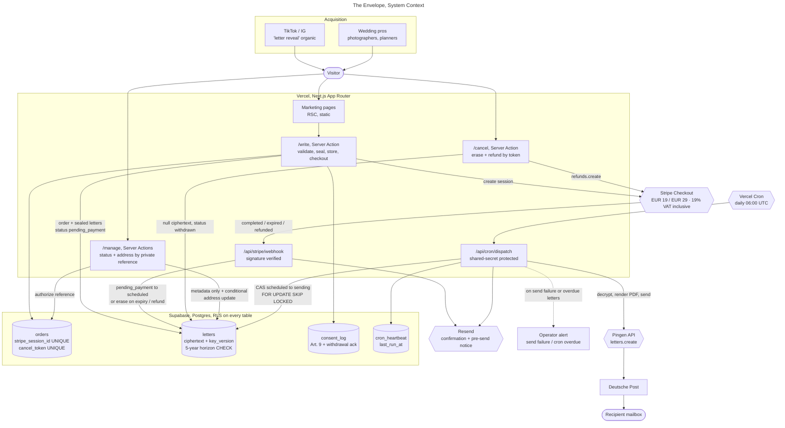
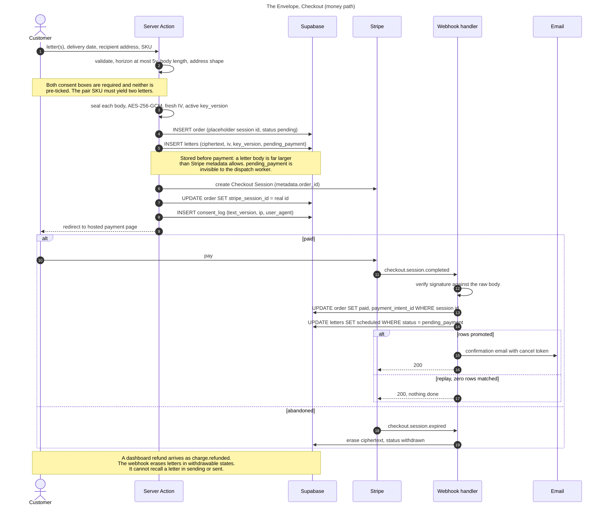
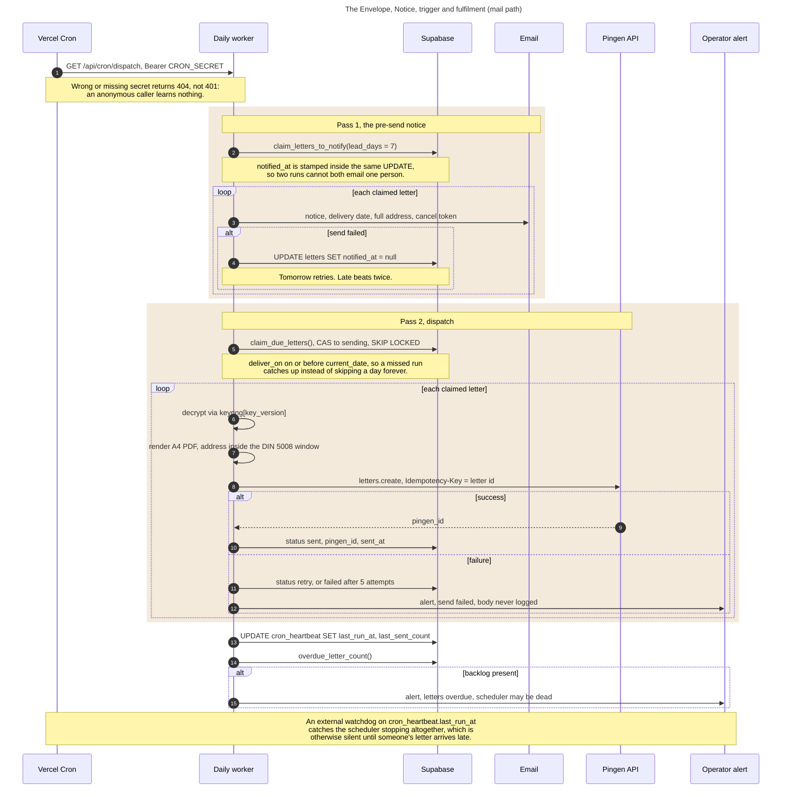

# The Envelope

[](https://github.com/kandulanikhilvarma/the-envelope/actions/workflows/ci.yml)

Write a letter today. The Envelope encrypts its words for storage.
Pingen prints and posts the letter on a future date you choose.
The chosen date is the posting date, rather than a guaranteed arrival date.

One letter costs €19. A couple's pair costs €29 for two letters with one posting date.
Both prices include 19% German VAT.

[Deployed site](https://the-envelope-six.vercel.app) · [Write a letter](https://the-envelope-six.vercel.app/write) · [Manage your letter](https://the-envelope-six.vercel.app/manage)

Vercel hosts the deployed site. Live payment, physical delivery and legal review need separate launch checks.
The Envelope is a proprietary project. See [LICENSE](LICENSE) before you use or distribute its code.

## What customers can do

- Write one letter or a pair, with a paper preview and a draft saved in the current browser tab.
- Choose a posting date from tomorrow to five years ahead. The default is twelve months.
- Pay once through Stripe Checkout. There are no customer accounts or subscriptions.
- Use a private reference to check status and correct each letter's address before print work starts.
- Use the same reference to cancel an eligible order, erase its letter content and get a refund.

The reference is a bearer credential: anyone who holds it can manage or cancel the order.
Management shows posting details and addresses, never the letter body.
The management and cancellation forms keep the reference out of browser URLs and persistent browser storage.

## Contents

- [Local setup](#local-setup)
- [Environment](#environment)
- [Architecture](#architecture)
- [Data and letter states](#data-and-letter-states)
- [Checks and tests](#checks-and-tests)
- [Operator guide](#operator-guide)
- [Pages and project layout](#pages-and-project-layout)
- [Design](#design)
- [Scope guardrails](#scope-guardrails)
- [License and contributions](#license-and-contributions)

## Local setup

Use Node.js 22 with native TypeScript support and npm. CI also uses Node.js 22.
The project scripts run TypeScript files directly through Node.

1. Install the locked dependencies.

   ```sh
   npm ci
   ```

2. Copy the environment template.

   PowerShell:

   ```powershell
   Copy-Item .env.example .env.local
   ```

   macOS or Linux:

   ```sh
   cp .env.example .env.local
   ```

3. Fill `.env.local` with your service credentials and encryption keys.
4. Apply the SQL files in [the migrations folder](supabase/migrations/) in filename order, from `0001` through `0005`.
5. Start the development server.

   ```sh
   npm run dev
   ```

Open [localhost:3000](http://localhost:3000).
Public pages can load without every service credential. Checkout, private management and dispatch need their service settings.
The repository has no migration command or ORM. Use your Supabase SQL tools to apply the migrations.

## Environment

[.env.example](.env.example) lists placeholder values. Keep real credentials in `.env.local` or the Vercel environment.
Never commit them.

| Variable | Purpose | Note |
|---|---|---|
| `NEXT_PUBLIC_SITE_URL` | Checkout redirects, email links and search metadata | Use the public origin in production. The app falls back to Vercel's production host, then its deployment host, then localhost. |
| `NEXT_PUBLIC_SUPABASE_URL` | Server connection to Supabase | Needed for database operations. |
| `SUPABASE_SERVICE_ROLE_KEY` | Server access to tables and RPCs | Bypasses RLS. Keep it server-only. |
| `STRIPE_SECRET_KEY` | Checkout and refunds | Use test credentials for local checks. |
| `STRIPE_WEBHOOK_SECRET` | Signature checks | Match the endpoint or local Stripe listener. |
| `LETTER_ENCRYPTION_KEYRING` | Keys that seal and open letters | JSON map of versions to base64-encoded 32-byte keys. Keep an offline escrow copy. |
| `LETTER_ENCRYPTION_ACTIVE_VERSION` | Key version for new letters | Must exist in the keyring. |
| `PINGEN_CLIENT_ID`, `PINGEN_CLIENT_SECRET`, `PINGEN_ORGANISATION_ID` | Print and post through Pingen | Needed for dispatch. |
| `PINGEN_API_BASE` | Pingen endpoint | Defaults to `https://api-staging.pingen.com`. |
| `CRON_SECRET` | Access to the dispatch route | Vercel Cron sends it in the bearer header. |
| `RESEND_API_KEY` | Customer emails and operator alerts | Without it, the app skips email and logs a warning. |
| `EMAIL_FROM` | Sender identity | Use an address on a verified Resend domain. |
| `OPERATOR_EMAIL` | Dispatch failure and backlog alerts | Without it, those alerts reach logs only. |

The template also contains `NEXT_PUBLIC_SUPABASE_ANON_KEY` and `ENABLE_AI_DRAFT`.
The app does not use the anon key or offer AI draft help.

The preflight script needs an explicit `NEXT_PUBLIC_SITE_URL`, even though the app supports the Vercel fallback.
Email settings are optional in code, but customer confirmations, notices and operator alerts need them in service.

To generate an encryption key:

```sh
node -e "console.log(require('crypto').randomBytes(32).toString('base64'))"
```

To generate a cron secret:

```sh
node -e "console.log(require('crypto').randomBytes(32).toString('base64url'))"
```

## Architecture

The app uses Next.js 16.3.5, React 19.2.8, TypeScript and Tailwind CSS v4.
Its six runtime dependencies are `next`, `react`, `react-dom`, `@supabase/supabase-js`, `stripe` and `pdfkit`.

Supabase holds the database. Stripe takes payment. Pingen prints and posts letters. Resend sends email. Vercel hosts the site.

Server Actions check browser input again before any database write.
Only server code uses the Supabase service-role key.
All five tables have RLS with no permissive client policy.
The migrations restrict each RPC to `service_role`; a route secret alone cannot protect a database RPC.

The three diagrams come from [the architecture folder](docs/architecture/).
The diagrams describe the intended flow. The notes below state the limits of the current code.

### System context


```mermaid
---
title: The Envelope, System Context
---
flowchart TB
    subgraph acq["Acquisition"]
        TT["TikTok / IG<br/>'letter reveal' organic"]
        WP["Wedding pros<br/>photographers, planners"]
    end

    V(["Visitor"])
    TT --> V
    WP --> V

    subgraph vercel["Vercel, Next.js App Router"]
        MKT["Marketing pages<br/>RSC, static"]
        APP["/write, Server Action<br/>validate, seal, store, checkout"]
        MAN["/manage, Server Actions<br/>status + address by private reference"]
        CXL["/cancel, Server Action<br/>erase + refund by token"]
        HOOK["/api/stripe/webhook<br/>signature verified"]
        CRON["/api/cron/dispatch<br/>shared-secret protected"]
    end

    V --> MKT
    MKT --> APP
    V --> CXL
    V --> MAN

    subgraph supa["Supabase, Postgres, RLS on every table"]
        ORD[("orders<br/>stripe_session_id UNIQUE<br/>cancel_token UNIQUE")]
        LET[("letters<br/>ciphertext + key_version<br/>5-year horizon CHECK")]
        CON[("consent_log<br/>Art. 9 + withdrawal ack")]
        HB[("cron_heartbeat<br/>last_run_at")]
    end

    APP -->|"order + sealed letters<br/>status pending_payment"| LET
    APP --> ORD
    APP --> CON
    HOOK -->|"pending_payment to scheduled<br/>or erase on expiry / refund"| LET
    CXL -->|"null ciphertext, status withdrawn"| LET
    MAN -->|"authorize reference"| ORD
    MAN -->|"metadata only + conditional address update"| LET
    CRON -->|"CAS scheduled to sending<br/>FOR UPDATE SKIP LOCKED"| LET
    CRON --> HB

    STRIPE{{"Stripe Checkout<br/>EUR 19 / EUR 29 · 19% VAT inclusive"}}
    APP -->|"create session"| STRIPE
    STRIPE -->|"completed / expired / refunded"| HOOK
    CXL -->|"refunds.create"| STRIPE

    MAIL{{"Resend<br/>confirmation + pre-send notice"}}
    HOOK --> MAIL
    CRON --> MAIL

    SCHED{{"Vercel Cron<br/>daily 06:00 UTC"}}
    SCHED --> CRON

    PIN{{"Pingen API<br/>letters.create"}}
    CRON -->|"decrypt, render PDF, send"| PIN
    PIN --> DP["Deutsche Post"]
    DP --> RCP(["Recipient mailbox"])

    ALERT["Operator alert<br/>send failure / cron overdue"]
    CRON -.->|"on send failure or overdue letters"| ALERT
```

The app seals each letter before checkout and stores it as `pending_payment`.
Unpaid letters cannot enter dispatch. A completed checkout schedules the letters; an expired checkout erases eligible content.

Private management checks the reference on every lookup and address edit.
An address update must match the letter ID, its order ID and an editable status in one database query.
If dispatch claims the letter first, the address update changes no row.

### Checkout

Configure the Stripe endpoint at `/api/stripe/webhook` for these events:

| Event | App behavior |
|---|---|
| `checkout.session.completed` | Mark the order paid and change `pending_payment` letters to `scheduled`. Send confirmation when letters change state. |
| `checkout.session.expired` | If the order has `pending` status, erase eligible letters. |
| `charge.refunded` | Mark the order refunded and erase letters in withdrawable states. |

A refund cannot recall a letter already in `sending` or `sent`.

[src/lib/pricing.ts](src/lib/pricing.ts) owns the amounts. The server never takes a price from the browser.
VAT comes from the gross amount, so net plus VAT equals the charge exactly.

<details>
<summary>Checkout sequence diagram</summary>


```mermaid
---
title: The Envelope, Checkout (money path)
---
sequenceDiagram
    autonumber
    actor U as Customer
    participant A as Server Action
    participant DB as Supabase
    participant S as Stripe
    participant W as Webhook handler
    participant M as Email

    U->>A: letter(s), delivery date, recipient address, SKU
    A->>A: validate, horizon at most 5y, body length, address shape
    Note over A,U: Both consent boxes are required and neither is<br/>pre-ticked. The pair SKU must yield two letters.

    A->>A: seal each body, AES-256-GCM, fresh IV, active key_version
    A->>DB: INSERT order (placeholder session id, status pending)
    A->>DB: INSERT letters (ciphertext, iv, key_version, pending_payment)
    Note over A,DB: Stored before payment: a letter body is far larger<br/>than Stripe metadata allows. pending_payment is<br/>invisible to the dispatch worker.

    A->>S: create Checkout Session (metadata.order_id)
    A->>DB: UPDATE order SET stripe_session_id = real id
    A->>DB: INSERT consent_log (text_version, ip, user_agent)
    A-->>U: redirect to hosted payment page

    alt paid
        U->>S: pay
        S->>W: checkout.session.completed
        W->>W: verify signature against the raw body
        W->>DB: UPDATE order SET paid, payment_intent_id WHERE session id
        W->>DB: UPDATE letters SET scheduled WHERE status = pending_payment
        alt rows promoted
            W->>M: confirmation email with cancel token
            W-->>S: 200
        else replay, zero rows matched
            W-->>S: 200, nothing done
        end
    else abandoned
        S->>W: checkout.session.expired
        W->>DB: erase ciphertext, status withdrawn
    end

    Note over U,DB: A dashboard refund arrives as charge.refunded.<br/>The webhook erases letters in withdrawable states.<br/>It cannot recall a letter in sending or sent.
```

</details>

### Notice and dispatch

Vercel Cron calls `/api/cron/dispatch` daily at 06:00 UTC.
The worker sends notices first, then claims due letters for dispatch.
A notice becomes eligible within seven days of the posting date.
Late orders or missed runs can shorten that interval.
Email failure does not stop dispatch.

The worker claims up to 50 due letters with `FOR UPDATE SKIP LOCKED`.
The claim changes `scheduled` or `retry` to `sending` and increases the `attempts` count.
The date predicate includes overdue letters, so a later run can catch up.
For each try, dispatch decrypts the letter and builds an A4 PDF.
Pingen gets the letter ID as the idempotency key for the send.

<details>
<summary>Notice and dispatch sequence diagram</summary>


```mermaid
---
title: The Envelope, Notice, trigger and fulfilment (mail path)
---
sequenceDiagram
    autonumber
    participant SCH as Vercel Cron
    participant WK as Daily worker
    participant DB as Supabase
    participant M as Email
    participant P as Pingen API
    participant OP as Operator alert

    SCH->>WK: GET /api/cron/dispatch, Bearer CRON_SECRET
    Note over SCH,WK: Wrong or missing secret returns 404, not 401:<br/>an anonymous caller learns nothing.

    rect rgb(243, 234, 219)
        Note over WK,M: Pass 1, the pre-send notice
        WK->>DB: claim_letters_to_notify(lead_days = 7)
        Note over WK,DB: notified_at is stamped inside the same UPDATE,<br/>so two runs cannot both email one person.
        loop each claimed letter
            WK->>M: notice, delivery date, full address, cancel token
            alt send failed
                WK->>DB: UPDATE letters SET notified_at = null
                Note over WK,DB: Tomorrow retries. Late beats twice.
            end
        end
    end

    rect rgb(243, 234, 219)
        Note over WK,P: Pass 2, dispatch
        WK->>DB: claim_due_letters(), CAS to sending, SKIP LOCKED
        Note over WK,DB: deliver_on on or before current_date, so a missed run<br/>catches up instead of skipping a day forever.
        loop each claimed letter
            WK->>WK: decrypt via keyring[key_version]
            WK->>WK: render A4 PDF, address inside the DIN 5008 window
            WK->>P: letters.create, Idempotency-Key = letter id
            alt success
                P-->>WK: pingen_id
                WK->>DB: status sent, pingen_id, sent_at
            else failure
                WK->>DB: status retry, or failed after 5 attempts
                WK->>OP: alert, send failed, body never logged
            end
        end
    end

    WK->>DB: UPDATE cron_heartbeat SET last_run_at, last_sent_count
    WK->>DB: overdue_letter_count()
    alt backlog present
        WK->>OP: alert, letters overdue, scheduler may be dead
    end

    Note over SCH,OP: An external watchdog on cron_heartbeat.last_run_at<br/>catches the scheduler stopping altogether, which is<br/>otherwise silent until someone's letter arrives late.
```

</details>

## Data and letter states

Five tables support the service:

| Table | Stores |
|---|---|
| `orders` | Package, amount, payment state, Stripe references, purchaser email and a unique private reference. |
| `letters` | Encrypted content, key version, destination, posting date, state and dispatch details. A pair has two rows. |
| `consent_log` | Order-linked acknowledgements, text version, IP address and user agent as evidence of consent. |
| `cron_heartbeat` | The latest worker time and sent count for an external watchdog. |
| `rate_limit` | Temporary counters keyed by action and a hash of the caller's IP address. |

[The schema migration](supabase/migrations/0001_initial_schema.sql) defines the first four tables and the date constraints.
[0005_rate_limit.sql](supabase/migrations/0005_rate_limit.sql) adds the fifth table.
The database rejects dates beyond five years or before tomorrow at the time of creation.
A separate `created_on` date avoids a non-immutable timestamp cast in the constraint.

The reference is a random UUID in `orders.cancel_token`, rather than the order ID.
The payment webhook stores `stripe_payment_intent_id` for refunds.
Withdrawal clears `content_ciphertext`, `content_iv` and `key_version` for eligible letters.

```text
compose + encrypt
       |
       v
pending_payment -- checkout expired --> withdrawn
       |
       | payment webhook
       v
   scheduled -- cancellation / refund --> withdrawn
       |
       | daily claim
       v
    sending ---- Pingen success ----> sent
       |
       | Pingen failure
       v
     retry ----- fifth failure ----> failed
       |                              |
       | next daily claim             | operator action needed
       v                              v
    sending                     no automatic retry
```

`pending_payment`, `scheduled`, `retry` and `failed` are withdrawable.
Customer cancellation applies to the whole order.
The action refuses cancellation if either letter is already `sending` or `sent`.
Address edits need a paid order and a letter in `scheduled`, `retry` or `failed`.
An edit changes only the destination.
An edit does not restart a failed letter, change its date or decrypt its content.

### Encryption and keys

Keep all older key versions in the keyring. A letter can wait five years before dispatch needs its key.
If you remove a key, you can permanently destroy access to every letter under that version.
Keep an offline escrow copy before any rotation.

1. Add the new key beside the existing versions.
2. Update the escrow copy.
3. Change `LETTER_ENCRYPTION_ACTIVE_VERSION` to the new version.
4. Check that the old versions remain available.

The app uses AES-256-GCM with a fresh 12-byte IV for each letter and a 16-byte authentication tag.
Dispatch decrypts content for each try and each retry.
Management does not select encrypted content. Customer emails contain references and addresses, never letter text.

After success, dispatch marks letters `sent`. The worker keeps their ciphertext fields.
Do not treat successful dispatch as a content-erasure operation.
See [SECURITY.md](SECURITY.md) for key and credential rules.

### Replay and concurrency guards

| Boundary | Guard |
|---|---|
| Payment webhook replay | The unique Stripe session maps to one order. A letter-state predicate prevents repeated promotion and confirmation email. |
| Concurrent dispatch runs | A database claim uses row locks and changes state atomically. |
| Pingen retry after a lost response | The letter ID is the `Idempotency-Key`. |
| Concurrent notice runs | The claim stamps `notified_at`. Email failure clears it for a later retry. |
| Repeated cancellation | Erasure matches withdrawable states only. An already withdrawn order reports its existing state. |
| Address edit during dispatch | The update matches ownership and an editable state in the same query. |

The Pingen idempotency header is part of the client design. A physical test letter remains necessary to check provider behavior.

### Limits and headers

Each caller has separate counters for three actions:

| Action | Limit | Counted |
|---|---|---|
| Compose | 5 submissions in 10 minutes | After input and consent checks. |
| Cancel | 10 tries in 1 hour | Before reference checks. |
| Manage | 30 lookups, refreshes or edits in 10 minutes | Before reference and address checks. |

The limiter fails open if its database check fails. The daily worker removes old counter rows.

[next.config.ts](next.config.ts) adds HSTS, `nosniff`, frame protection, a referrer policy and a closed permissions policy.
The config also sets `Cross-Origin-Opener-Policy` and disables the framework header.
The app has no Content Security Policy. A nonce-based policy remains separate work.
Error boundaries show a digest rather than the underlying error text.
Private pages have `noindex`; robots rules exclude them and the API routes.

## Checks and tests

| Command | Purpose |
|---|---|
| `npm run dev` | Start the local development server on port 3000. |
| `npm run build` | Build the app for production. |
| `npm start` | Serve a completed production build. |
| `npm run lint` | Check the source with ESLint. |
| `npm run typecheck` | Generate Next.js route types, then run TypeScript checks. |
| `npm test` | Run `src/lib/*.test.ts` with Node's test runner. |
| `npm run test:manage` | Run isolated browser checks for management and the shared address fields. |
| `npm run preflight` | Check the credentials and connections to real services. |
| `npm run pdf-proof` | Build a proof PDF and check the DIN 5008 address window. |
| `npm run test-letter` | Send a test letter through Pingen to your address. |

Run the same four checks as CI before a PR:

```sh
npm run lint
npm run typecheck
npm test
npm run build
```

Unit tests cover encryption, signatures, prices, dates, email text, withdrawal, limits, site URLs and private management.
Management tests use synthetic database responses. They check metadata-only reads, ownership predicates, editable states and database errors.
The suite uses Node's built-in runner and native TypeScript support.

`npm run test:manage` starts a separate Next.js server with an isolated Supabase fixture.
The browser checks cover pair-address independence, status refresh, a dispatch race, reference privacy, mobile layout and dark mode.
The script also checks the shared compose fields. The script contacts no live service.
Screenshots go to the ignored `browser-proof` directory.

The browser script needs Playwright and a browser.
Install Chromium through Playwright, or set `PLAYWRIGHT_CHANNEL` to a system browser such as `msedge` or `chrome`.
If Playwright exists elsewhere, set `PLAYWRIGHT_MODULE_PATH` to its package directory.

Preflight uses `.env.local` when present.
Preflight checks real Supabase, Stripe, Pingen authentication and Resend domain settings.
Preflight also adds a temporary rate-limit counter.
Preflight does not dispatch customer letters or test physical delivery.
A green preflight does not prove the payment webhook or print-and-post flow works end to end.

## Operator guide

### Launch checks

Keep credentials in the correct local and Vercel environments before these checks.
Use Pingen staging first. The live test-letter command prints and posts a real letter when you select the production endpoint.

1. Apply all five database migrations.
2. Configure the service variables in Vercel, with the public site URL.
3. Configure Stripe's three webhook events and the endpoint signing secret.
4. Run `npm run preflight` with credentials for the environment under test.
5. Run `npm run pdf-proof`.
6. Send a staging test letter with `npm run test-letter` and your address arguments.
7. Switch Pingen to production only for the planned physical test.
8. Post a real letter to yourself.
9. Check the address window, text margins and physical arrival.
10. Test payment, webhook completion, checkout expiry and refund end to end.
11. Replace the legal placeholders in the imprint, privacy notice and terms.
12. Get review of the consent text and the goods-or-service classification.

Example test-letter command:

```sh
npm run test-letter -- --name "Your Name" --line1 "Street 1" --postcode "10115" --city "Berlin" --country DE
```

The repository does not establish completed live payment, physical Pingen delivery or legal review.
The Pingen client still records its live-account status as unverified.
Consent uses `CONSENT_TEXT_VERSION`, so each evidence row points to the wording shown at checkout.
The goods-or-service classification remains an open legal decision.

### Daily dispatch and alerts

The cron route returns `{ claimed, sent, failed, notices, overdue }`.
Its database backlog count includes `scheduled`, `retry` and `sending` letters more than one day past their date.
The count excludes terminal `failed` letters.
Operator alerts need `OPERATOR_EMAIL` and an active Resend setup.
A failed send or overdue backlog triggers an alert email.

Install an external watchdog for `cron_heartbeat.last_run_at`.
Nothing in this repository watches the heartbeat.
The dispatch worker cannot report its own absence when the scheduler stops.

### A letter stuck in `sending`

Check Pingen for the letter ID used as its idempotency key before any retry.
If Pingen accepted the letter, record its Pingen ID and sent state.
If Pingen did not accept it, return the row to `retry` after you check the failure.

A letter stops at `failed` after five failed attempts.
Investigate the cause before an operator returns it to `retry`.
An address change leaves this state and the `attempts` count unchanged.

### Email and refunds

Confirmation goes out after the payment webhook schedules letters.
The confirmation page also shows the private reference.
The code does not enforce one-time page access.
Keep the email reference as the customer's durable copy.
The pre-send notice includes the stored destination and the same reference.
Both emails link to `/manage` without a reference in the URL.

Email failure does not reverse payment or stop dispatch.
The worker clears a failed notice claim for a later retry. The confirmation email has no automatic retry queue.

Customer cancellation erases eligible content before it asks Stripe for a refund.
If the refund fails, an operator must resolve the payment.
The letter content is already gone.
A dashboard refund also erases eligible content through the webhook.
Neither path can recall a letter that print work already claimed.

## Pages and project layout

| Route | Purpose |
|---|---|
| `/` | Product overview, occasions, example letter, prices and FAQ. |
| `/write` | Letter form, preview, date presets, consent and tab draft. Supports `occasion`, `sku` and `cancelled` query parameters. |
| `/written` | Checkout return page, private reference, calendar file and draft removal. |
| `/manage` | Private status lookup and separate address edits for each letter. |
| `/cancel` | Order cancellation, content erasure and refund. |
| `/promise` | Published wind-down promise. |
| `/privacy`, `/terms`, `/imprint` | Privacy notice, terms and operator identity; legal placeholders remain. |
| `/api/stripe/webhook` | Stripe signature checks and the three event handlers. |
| `/api/cron/dispatch` | Notice and dispatch worker. Returns 404 without the shared secret. |
| `/robots.txt`, `/sitemap.xml` | Crawl exclusions and the six public page URLs. |

```text
src/app/                   pages, Server Actions and API routes
src/components/            artwork, icons, site chrome and address fields
src/lib/                   encryption, validation, providers and domain logic
supabase/migrations/       schema, RPC permissions, notices and rate limits
docs/architecture/         Mermaid sources for the three diagrams
scripts/                   preflight, PDF proof, test letter and browser checks
```

Prices live in `src/lib/pricing.ts`; date and address checks live in `src/lib/letters.ts`.
Management authorization and atomic updates live in `src/lib/manage.ts`.
The PDF renderer uses A4 paper with the recipient inside the DIN 5008 window.
Generated share images and icons use the site's seal artwork.

## Design

The site uses ivory paper, oxblood actions, sage status feedback and decorative antique gold.
Fraunces supplies display text; Source Serif 4 supplies body text.
`next/font` serves both fonts locally.
Light and dark themes share semantic tokens in `src/app/globals.css`.
The interface respects reduced-motion preferences.

See [DESIGN.md](DESIGN.md) for colors, typography, controls and layout rules.
See [PRODUCT.md](PRODUCT.md) for the product brief and private-management constraints.
Use shared address fields and tokens when you extend the interface.
Keep each letter's destination and status with its own record.

## Scope guardrails

The following policies define the product scope. Do not widen them through a code refactor or document edit.

- One trigger type: a future date. No dead-man's switch or inactivity triggers.
- No third-party letters. Self-directed only. Do not send disclosures about someone to a third party.
- A five-year horizon, with twelve months as the default. App checks and a database constraint enforce the cap.
- Pay-at-send fulfilment. Spend postage when the date arrives. The customer pays for the service at checkout.
- A published wind-down promise. If the service closes, post undelivered letters early or return them.

## License and contributions

Copyright © 2026 Kandula Nikhil Varma. All rights reserved.
[LICENSE](LICENSE) defines the proprietary terms. The repository does not grant an open-source license.

[The contribution guide](CONTRIBUTING.md) describes feature branches, short Conventional Commits and squash merges after green checks.
[SECURITY.md](SECURITY.md) covers private reports, credentials and encryption keys.
